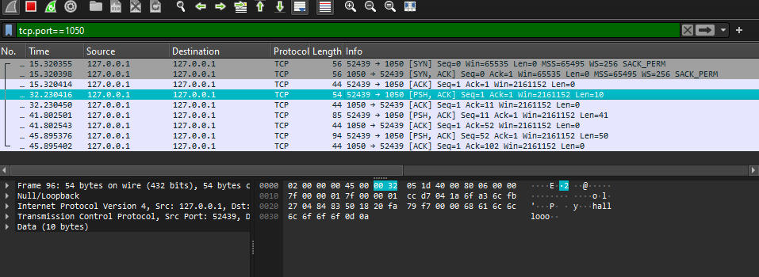
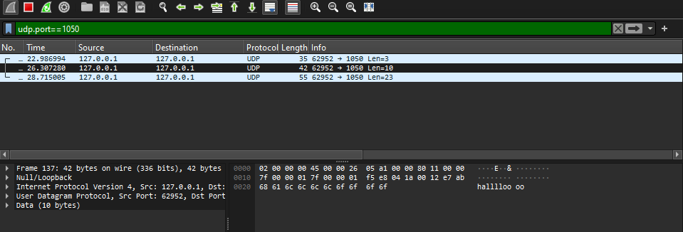
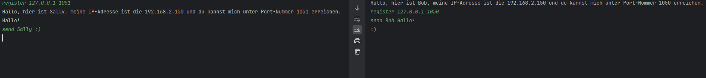
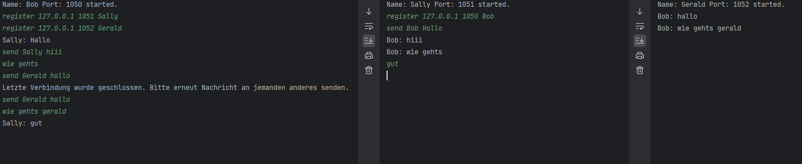
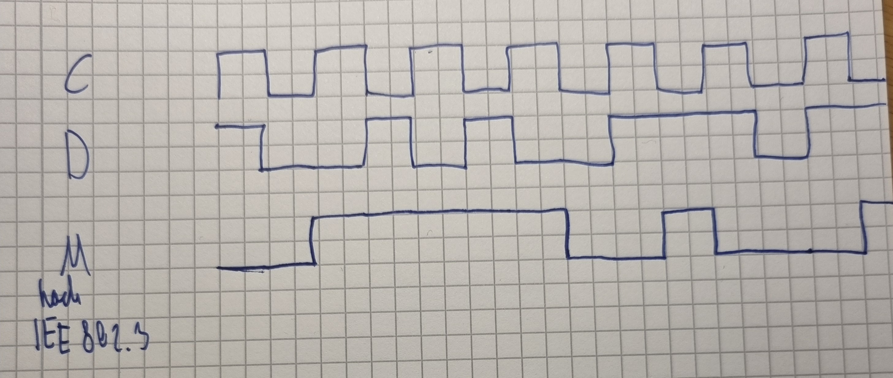

## Aufgabe 1)

nc_udp und nc_tcp wie aus der Vorlesung übernommen und ausprobiert.

mit tcp.port==1050 und udp.port==1050 filter ich die Pakete raus die durch
nc_udp und nc_tcp erzeugt werden.
Dabei ist mir aufgefallen das tcp deutlich mehr bytes benötigt und mehr Pakete sendet als udp.

Das liegt daran das tcp eine Bestätigungsnaricht an den Sender schickt, damit sichergestellt wird das die Nachricht erhalten wurde.
Zusätzlich besteht durchgehend eine Verbindung zwischen Sender und Empfänger, um Fehler zu beheben, falls welche entstehen.

-> udp garantiert nicht erhalt der nachricht.

(Siehe Bild 1 und Bild 2)

tcp

udp

In den Screenshots kann man gut erkennen, dass mit TCP ACK-Pakete versendet werden, um den Erhalt der Nachricht zu bestätigen.
So wird sichergestellt, dass die Nachricht auch wirklich ankommt. Im Gegensatz dazu arbeitet UDP nach dem Best-Effort-Prinzip 
und sendet somit keine Bestätigungsnachrichten.

## Aufgabe 2)

mit "start &lt;port&gt; &lt;eigener_name&gt;" startet man seinen Client.

mit "register &lt;ip_vom_partner&gt; &lt;port_vom_partner&gt;" kann man sich bei einen anderen Client registrieren

mit send name message kann man nachrichten verschicken.

Bsp- Konversation:

## Aufgabe 3)

mit "start &lt;port&gt; &lt;eigener_name&gt;" startet man seinen Client.

mit "register &lt;ip_vom_partner&gt; &lt;port_vom_partner&gt; &lt;name_vom_partner&gt;" kann man sich bei einen anderen Client registrieren

mit send name message kann man nachrichten verschicken. Send muss aber nur in der ersten Nachricht stehen, danach kann man
einfach eingeben. Falls man fertig gechattet hat sollte man stop schreiben. Wenn man das nicht tut und versucht an jemanden
anderes zu senden, wird der vorherige chat automatisch gestoppt, und man wird aufgefordert erneut die Nachricht zu versenden.

Bsp- Konversation:

## Aufgabe 4)

Manchester-Codierung des Codes:

