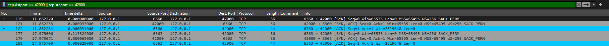

# Rechnernetze Übungsblatt03 David Jacobs 1619007

## Aufgabe 1

### nc_udp

Server starten mit Argumenten "-l 42000". -l für listen, 42000 ist der Port.
Als Client starten mit "127.0.0.1 42000", IP und Port.
Im Client kann über die Konsole eine Nachricht eingeben werden und and den Server verwendet.
Dieser printet die Nachricht

Wireshark: Hier sehen wir zu jeder Nachricht ein UDP Paket vom Client an den Server

### nc_tcp

Starten der Applikation wie bei nc_udp

Wireshark:

Zunächst wird durch einen 3-Way-Handshake zwischen Client und Server die Verbindung zwischen beiden herstellt.
Danach können über die bestehende Verdindung Nachrichten vom Client an den Server geschickt werden.

### Vergleich beider Programme

TCP verlangt das Aufbauen einer Verbindung zwischen Client und Server via Handshake. Dafür müssen extra Pakete versendet werden, es kommt zu mehr Overhead. UDP benötogt dies nicht. Daher ist das Datenvolumen bei UDP geringer.
Pro Nachricht werden bei beiden Programmen jedoch je ein Paket com Client zum Server versendet, das die Nachricht enthält.

## Aufgabe 2

### Idee

In einer Peers-Map werden alle aktiven Clients über "register <name> <ip> <port>" registriert. Wenn ein Client nun eine Nachricht an einen anderen Client senden will via "send Eric hallo" geht diese Nachricht an den Server, welcher überprüft, ob Eric in der Peers-Map enthalten ist. Falls ja wird die Nachricht an die Adresse von Eric gesendet, welchen als value in der Map vorliegt.

### Umsetzung

Der Server registriert Clients korrekterweise. Jedoch gelang es mir nicht die Nachricht korrekt zum Empfänger weiterzuleiten, da die Clients auf eine eigene Peer-Map zurückgriffen und diese nicht vollständig mit der des Servers übereinstimmte.

### Aufgabe 3

### Idee

In einer Clients-Map verwaltet der Server bestehende Verbindungen zu Clients. Ein Client kann über "send <ip:port> <message>" eine Nachricht über den Server an einen anderen Client schicken.

### Umsetzung

Beim Aufbau einer Verbindung eines Clients zum Server wird der Client in die Clients-Map aufgenommen. Beim Beenden der Verbindung, wird er wieder entfernt. Sendet ein Client eine Nachricht via ""send <ip:port> <message>", schaut der Server, ob die Adresse in Clients vorhanden ist. Falls ja, sendet der Server über einen Printwriter die Nachricht weiter zum Adressaten und nutzt dabei die bestehende TCP-Verbindung.
Auf Client-Seite wartet ein separater Thread auf eingehende Nachrichten und gibt diese bei Erhalt aus.

Server + 2 Clients:

3-Way Handshake 2 Clients:

Client 1 schickt Nachricht:

Client 2 empfängt Nachricht:

Wir sehen, dass für das Verschicken einer Nachricht 4 Paket versendet werden:
1. Client 1 verschickt Paket an Server
2. Server bestätigt dies C1
3. Server sendet Paket mit der Nachricht an C2
4. C2 acknowledged

Anmerkung: Das Programm kann leicht so angepasst werden, dass statt ip+port Namen verwendet werden.

## Aufgabe 4

